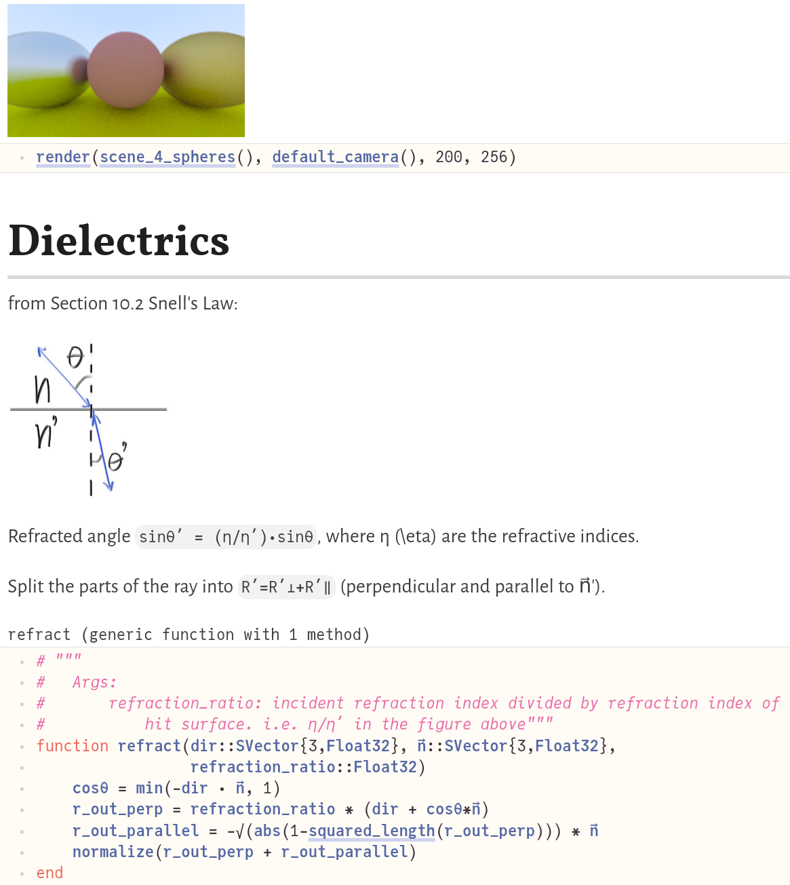

# RayTracingWeekend

Adapted from [Ray Tracing In One Weekend by Peter Shirley](https://raytracing.github.io/books/RayTracingInOneWeekend.html) and [cshenton's Julia implementation](https://github.com/cshenton/RayTracing.jl)




# Implementation details

This Julia code is more complicated than required, for a few reasons:
- I'm far from a Julia expert yet. Hopefully real experts will suggest improvements.
- I optimized for execution speed rather than code simplicity. I also plan to support running on multi-thread and GPU, to see if I can match optimized SIMD C++/CUDA/ROCM performance.

So I:
- picked Float32 instead of Float64, because that will likely run twice as fast on GPU
- tried to minimize memory allocations (allocation on the stack instead of the heap, e.g. using StaticArrays)
- plan to pre-allocate groups of rays into tensors to support higher parallelism.
- don't use abstract types, because I couldn't get them to work fast. Instead I reuse `StaticArrays{3,Float32}` for both `Vec3` and `Color`, etc. (I'm sure there's a cleaner way - if you know it, please tell me!)

If you're interested in the performance details, please:
1. participate in this discussion: https://discourse.julialang.org/t/ray-tracing-in-a-week-end-julia-vs-simd-optimized-c/72958/3
2. see the git history and comments in `proto.jl`, where I used `@btime` and `julia --track-allocation=user` to optimize what were the most obvious performance bottlenecks. Please note that this code is still extremely messy, I'm mainly working on this during week-ends and I plan to clean it up after I optimize the code further. 

# Known issues

- the negatively scaled sphere has a black halo inside it. Maybe numerical inaccuracies cause the rays to stay stuck inside, incorrectly? I haven't focused on this issue yet... but if anyone knows how to fix this, please tell me!

# Adapting C++ --> Julia

These notes may be useful if you're new to Julia...

1. To start the notebook: [Pluto installation and usage](https://github.com/fonsp/Pluto.jl#lets-do-it)
2. Using the web interface, open the `pluto_RayTracingWeekend.jl` file.
3. The first time it may take up to 1-2 mins to download all the necessary packages, and evaluate all the cells.
4. Please note that the Julia coding conventions aren't respected in this project, in part to make it easier to follow along the C++ code.
5. Tips on starting with Julia:
  - consult the references below
  - if you don't know how to type a unicode character (e.g. n⃗) in Julia, use the Julia help `julia` then `?`, then cut-and-paste the character. That particular character is typed using `n\vec` then pressing TAB.

Unlike the C++ implementation:
- I didn't implement each chapter separately (except for the first few), instead I focused on making the Pluto.jl implementation able to run most examples in the book with minimal duplication in the code.
- I didn't bother implementing PPM file format support, no point for it since Pluto.jl and vscode can both display images directly without saving them to disk first.
- Julia uses i for row, j for column, so I inverted some of the loops (to iterate through columns first) and some of the C++ code's variable names.
- When saving final pixels, IIUC the C++ code uses a Y-up coordinate system for writing images. Julia's `Image`s and matrices point down, so I used `(ny-i)` instead of `i` for the row number.
- Pluto.jl supports having cells/code defined in arbitrary orders. I tried to keep the code from low-level to high-level, but in some cases it wasn't practical, especially since Pluto.jl doesn't seem to support moving more than one cell at a time.


# References:
- [Ray Tracing In One Weekend by Peter Shirley](https://raytracing.github.io/books/RayTracingInOneWeekend.html)
- [ChrisRackauckhas's awesome MIT course of Parallel Computing and Scientific Machine Learning](https://github.com/mitmath/18337): I only watched the first few lessons on performance optimization so far, but I learnt a lot already and highly recommend it.
- https://docs.julialang.org/en/v1/manual/integers-and-floating-point-numbers/#Floating-Point-Numbers
- [cshenton's Julia implementation](https://github.com/cshenton/RayTracing.jl): This was useful as a starting point as I developed something roughly similar at first, then I tried it optimize it further.


# Failed attempts

## using Base.getproperty() for `vec.x` instead of `vec[1]`.

This was meant to be a convenient function to get `some_vec.x` or `some_color.r`, but this causes ~41 allocations per call, so this was a huge bottleneck.
TODO: replace by a lens? i.e. see https://youtu.be/vkAOYeTpLg0?t=426

```
import Base.getproperty
function Base.getproperty(vec::SVector{3}, sym::Symbol)
    #  TODO: use a dictionary that maps symbols to indices, e.g. Dict(:x->1)
    if sym in [:x, :r]
        return vec[1]
    elseif sym in [:y, :g]
        return vec[2]
    elseif sym in [:z, :b]
        return vec[3]
    else
        return getfield(vec, sym)
    end
end
```