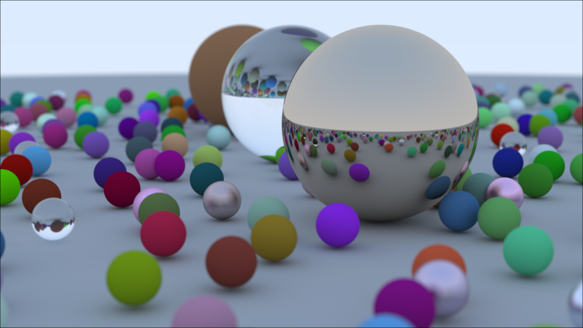

# RayTracingWeekend

Adapted from [Ray Tracing In One Weekend by Peter Shirley](https://raytracing.github.io/books/RayTracingInOneWeekend.html) and [cshenton's Julia implementation](https://github.com/cshenton/RayTracing.jl)





# Implementation details

This Julia code is more complicated than required, because I optimized it for execution speed rather than code simplicity. I also plan to support running on GPU, to see if I can match optimized SIMD C++/CUDA/ROCM performance. Finally, I refrained from implementing high-level optimizations like BVHs and smarter sampling, because I want a fair comparison with the C++ implementation.

So:
- We're using parameterized floating-point types (thanks @woclass!), which allows us to switch between Float32 and Float64 calculations, but makes the code somewhat more complex...
- We're using Vec3 for both C++'s `Vec3` and `Color`.
- I tried to minimize memory allocations (allocation on the stack instead of the heap, e.g. using StaticArrays)
- I plan to pre-allocate groups of rays into tensors to support higher parallelism (but only after I exhausted less intrusive low-level optimizations, to be fair against the SIMD-optimized C++ implementation that doesn't go to that extent)

If you're interested in the performance details and the latest optimizations, please:
1. participate in this discussion: https://discourse.julialang.org/t/ray-tracing-in-a-week-end-julia-vs-simd-optimized-c
2. see the git history and comments in `proto.jl`, where I make the latest changes, and will occasionally merge them back in the Pluto notebook. 

# Competitive Targets: GPSnoopy's ISPC C++ and Vulkan implementations

https://github.com/GPSnoopy/RayTracingInOneWeekend

All perf tests were run on my Ryzen 2700 (not overclocked) on Ubuntu 20.04.

## GPSnoopy's C++ implementation using GCC

1. I modified the code to run at 1920x1080x1000 instead of 3840x2160x1000.
2. Compiled with `g++ -o book1 -std=c++1z -Wall -Wextra -O3 -ffast-math -march=znver2 main.cpp -lpthread`, using `gcc version 9.3.0 (Ubuntu 9.3.0-17ubuntu1~20.04)`.
  - Notice `-ffast-math` - I haven't tried that yet in my Julia version.
  - `-march=znver2` allows gcc to optimize specifically for this Zen2 CPU architecture.
3. Even though I have 16 physical threads on this CPU, gcc reports it only used 14 threads. The CPU temperature hovered around 83 degrees Celsius, i.e. warm but not alarming.
4. I examined the code, and it looks like it's using the same algorithms, i.e. no BVH. I also checked that the threaded model is similar.
5. I have no idea whether GCC tries to vectorize the code, and by how much.

Result of `time ./book1`: **22m59s** (1379s).

## GPSnoopy's ISPC implementation

IIUC ISPC is a customized version of C specialized for SIMD and GPGPU.

1. I modified the code to run at 1920x1080x1000 instead of 3840x2160x1000.
2. Compiled with the `build_linux.sh` script, using `ispc-v1.16.1-linux` (i.e. latest stable compiler version)
3. All 16 threads seemed in use, the fans were pushed to the max, and the temperature hovered around 91.3 degrees Celsius... I'm not sure it would be a good idea to let it run for long at that temperature. I'd feel safer if I had a liquid-cooled heat sink...
4. I took a brief look at the ISPC code and I guess their high performance can in part be explained by a more optimized memory layout and of course, a language and compiler focused 100% on SIMD. 

Result of `time ./book1`: **6m5s**. A very impressive speed-up!

## Latest Julia version (see proto.jl)

Method:
1. In proto.jl, uncomment `@time render(scene_random_spheres(; elem_type=ELEM_TYPE), t_cam1, 1920, 1000)`
2. then run using `julia --project=. --threads=16 --math-mode=fast --optimize=3 --cpu-target=znver2 src/proto.jl`.

Notes:
- The following arguments didn't make any noticeable difference (yet?): `--math-mode=fast --optimize=3 --cpu-target=znver2`
- I didn't add `@fastmath` to any lines of code yet.
- I didn't try to optimize w/ SIMD/LoopVectorization yet.
- I use Float64, compared to the C++ versions that use Float32. (But Float32 in this Julia implementation is currently slower.)
- I haven't tried running the Julia profiler yet, there are probably low-hanging fruits left that don't require algorithmic change.
- The C++ version uses a 32-bit Mersenne IIUC, might be a bit faster to compute and certainly much less random than the SOTA Xoroshiro128Plus I use in Julia.

Latest results:
- With 16 threads: **21m22s**
- with 14 threads: **21m45s** (1306s), i.e. now ~5.6% faster than the equivalent GCC C++ version!

Detailed timings, starting from my original, super-slow version.
```
After some optimization, took ~5.6 hours:
  20171.646846 seconds (94.73 G allocations: 2.496 TiB, 1.06% gc time)
... however the image looked weird... too blurry
After removing all remaining Color, Vec3, replacing them with @SVector[]... took ~3.7 hours:
  13326.770907 seconds (29.82 G allocations: 714.941 GiB, 0.36% gc time)
Using convert(Float32, ...) instead of MyFloat(...):
Don't specify return value of Option{HitRecord} in hit()
Don't initialize unnecessary elements in HitRecord(): 
Took ~4.1 hours:
  14723.339976 seconds (5.45 G allocations: 243.044 GiB, 0.11% gc time) # WORSE, probably because we're writing a lot more to stack...?
Replace MyFloat by Float32:
Lots of other optimizations including @inline lots of stuff: 
   6018.101653 seconds (5.39 G allocations: 241.139 GiB, 0.21% gc time) (1.67 hour)
@woclass's rand(Float32) to avoid Float64s: (expected to provide 2.2% speed up)
@woclass's "Use alias instead of new struct", i.e. `const HittableList = Vector{Hittable}`
@woclass's Vec3{T} with T=Float64: (7.8% speed-up!): 
   5268.175362 seconds (4.79 G allocations: 357.005 GiB, 0.47% gc time) (1.46 hours)
Above was all using 1 single thread. With 16 threads: (~20 minutes)
   1210.363539 seconds (4.94 G allocations: 368.435 GiB, 10.08% gc time)
Above was all using max bounces=4, since this looked fine to me (except the negatively scaled sphere). 
Switching to max bounces=16 to match C++ version decreased performance by 7.2%:
   1298.522674 seconds (5.43 G allocations: 404.519 GiB, 10.18% gc time)
Using @inbounds, @simd in low-level functions:
   1314.510565 seconds (5.53 G allocations: 411.753 GiB, 10.21% gc time) # NOTE: difference due to randomness?
Adapt @Christ_Foster's Base.getproperty w/ @inline @inbounds: (expect 3-5% speed-up)
Eliminate the off-by-half-a-pixel offset: (expect ~2.5% speed-up)
Fixed, per-thread RNGs with fixed seeds (expecting no noticeable change in speed)
 Using 16 threads: (21m22s)
   1282.437499 seconds (5.53 G allocations: 411.742 GiB, 10.08% gc time) (i.e. 2.5% speed-up... currently GC- and memory-bound?)
 Using 14 threads: (21m45s)
   1305.767627 seconds (5.53 G allocations: 411.741 GiB, 9.97% gc time)
```

# Adapting C++ --> Julia

These notes may be useful if you're new to Julia...

1. To start the notebook: [Pluto installation and usage](https://github.com/fonsp/Pluto.jl#lets-do-it)
2. Using the web interface, open the `pluto_RayTracingWeekend.jl` file.
3. The first time it may take up to 1-2 mins to download all the necessary packages, and evaluate all the cells.
4. Please note that the Julia coding conventions aren't respected in this project, in part to make it easier to follow along the C++ code.
5. Tips on starting with Julia:
  - consult the references below
  - if you don't know how to type a unicode character (e.g. n⃗) in Julia, use the Julia help `julia` then `?`, then cut-and-paste the character. That particular character is typed using `n\vec` then pressing TAB.

Unlike the C++ implementation:
- I didn't implement each chapter separately (except for the first few), instead I focused on making the Pluto.jl implementation able to run most examples in the book with minimal duplication in the code.
- I didn't bother implementing PPM file format support, no point for it since Pluto.jl and vscode can both display images directly without saving them to disk first.
- Julia uses i for row, j for column, so I inverted some of the loops (to iterate through columns first) and some of the C++ code's variable names.
- When saving final pixels, IIUC the C++ code uses a Y-up coordinate system for writing images. Julia's `Image`s and matrices point down, so I used `(ny-i)` instead of `i` for the row number.
- Pluto.jl supports having cells/code defined in arbitrary orders. I tried to keep the code from low-level to high-level, but in some cases it wasn't practical, especially since Pluto.jl doesn't seem to support moving more than one cell at a time.
- I normalize the ray direction right away, instead of optionally doing it in later functions... I think it's easier to reason about it that way, and the extra cost is probably marginal.
- I use a `const _no_hit = HitRecord{Float64}()` to indicate a no hit... I thought this was speed things up, but this is probably a bad idea...


# References:
- [Ray Tracing In One Weekend by Peter Shirley](https://raytracing.github.io/books/RayTracingInOneWeekend.html)
- [ChrisRackauckhas's awesome MIT course of Parallel Computing and Scientific Machine Learning](https://github.com/mitmath/18337): I only watched the first few lessons on performance optimization so far, but I learnt a lot already and highly recommend it.
- https://docs.julialang.org/en/v1/manual/integers-and-floating-point-numbers/#Floating-Point-Numbers
- Other Julia raytracers
  - [cshenton's Julia implementation](https://github.com/cshenton/RayTracing.jl): This was useful as a starting point as I developed something roughly similar at first, then I tried it optimize it further.
  - https://github.com/pxl-th/Trace.jl : more sophisticated raytracer based on this excellent book: Physically Based Rendering: From Theory to Implementation"
  - https://github.com/paulmelis/riow.jl : another example based on Peter Shirley's books

# Special thanks to:

- @woclass: who recommended major clean-ups and speed-ups, I learnt a lot from his code!
- @Chris_Foster: lots of great suggestions to clean-up and speed-up the code!

# Possible next steps

## Short-term

- investigate whether Float32 perf degradation can be fixed (doubled the allocations...)
- update pluto_RayTracingWeekend.jl, then share on Twitter, etc.
- break the code into multiple files...
- replace `const _no_hit = HitRecord{Float64}()` by a distance check (would be type-independent)
  - then re-run Float32 and Float64 perf tests
- Read on the SIMD libraries, try to figure out the best approach. (I’ll welcome any suggestion you have!)
- save image, e.g. PNG
- continue watching MIT course

## Long-term

- Implement the rest of Peter Shirley's books, especially BVHs
- GPU through CUDA, ROCM
  - Probably integrate `Making the materials and hit system fully concrete with tight inner loops` idea from @Chris_Foster
  - The only remaining allocations that appear expensive are of `HitRecord`s (on the stack)
  - Probably pre-allocate the ray batches (I don’t know how they are called in the litterature) to later simplify the GPU (and probably the SIMD) implementation.
  - implement versions of hit, scatter, etc. that operate on an entire tensor at once.
  (i.e. efficiently parallelizable with SIMD or GPU)
  - use FieldVector and/or StructOfArrays?
- Vulkan RT interface, e.g. port of https://github.com/KhronosGroup/Vulkan-Samples/tree/master/samples/extensions/raytracing_basic

# Failed attempts

## using Base.getproperty() for `vec.x` instead of `vec[1]`.

This was meant to be a convenient function to get `some_vec.x` or `some_color.r`, but this caused ~41 allocations per call, so this was a huge bottleneck.
TODO: replace by a lens? i.e. see https://youtu.be/vkAOYeTpLg0?t=426

```
import Base.getproperty
function Base.getproperty(vec::SVector{3}, sym::Symbol)
    #  TODO: use a dictionary that maps symbols to indices, e.g. Dict(:x->1)
    if sym in [:x, :r]
        return vec[1]
    elseif sym in [:y, :g]
        return vec[2]
    elseif sym in [:z, :b]
        return vec[3]
    else
        return getfield(vec, sym)
    end
end
```

## Negatively scaled sphere needs >4 bounces

Previously I used 4 bounces max per ray path, and the negatively scaled sphere had a black halo inside it. Increasing the bounce count to 16 resolved the issue.
