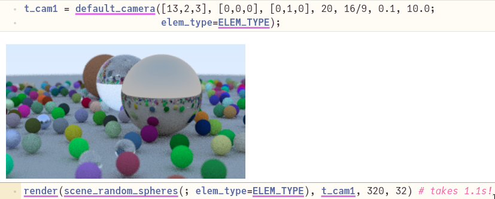

# RayTracingWeekend

Adapted from [Ray Tracing In One Weekend by Peter Shirley](https://raytracing.github.io/books/RayTracingInOneWeekend.html) and [cshenton's Julia implementation](https://github.com/cshenton/RayTracing.jl)





# Implementation details

This Julia code is more complicated than required, for a few reasons:
- I'm far from a Julia expert yet. Hopefully real experts will suggest improvements.
- I optimized for execution speed rather than code simplicity. I also plan to support running on multi-thread and GPU, to see if I can match optimized SIMD C++/CUDA/ROCM performance.

So I:
- tried to minimize memory allocations (allocation on the stack instead of the heap, e.g. using StaticArrays)
- plan to pre-allocate groups of rays into tensors to support higher parallelism.
- We're using parameterized floating-point types (thanks @woclass!), which allows us to switch between Float32 and Float64 calculations, but makes the code somewhat more complex...
- using Vec3 for both C++'s `Vec3` and `Color`.

If you're interested in the performance details and the latest optimizations, please:
1. participate in this discussion: https://discourse.julialang.org/t/ray-tracing-in-a-week-end-julia-vs-simd-optimized-c
2. see the git history and comments in `proto.jl`, where I make the latest changes, and will occasionally merge them back in the Pluto notebook. 

# Known issues

- the negatively scaled sphere has a black halo inside it. Maybe numerical inaccuracies cause the rays to stay stuck inside, incorrectly? I haven't focused on this issue yet... but if anyone knows how to fix this, please tell me!

# Adapting C++ --> Julia

These notes may be useful if you're new to Julia...

1. To start the notebook: [Pluto installation and usage](https://github.com/fonsp/Pluto.jl#lets-do-it)
2. Using the web interface, open the `pluto_RayTracingWeekend.jl` file.
3. The first time it may take up to 1-2 mins to download all the necessary packages, and evaluate all the cells.
4. Please note that the Julia coding conventions aren't respected in this project, in part to make it easier to follow along the C++ code.
5. Tips on starting with Julia:
  - consult the references below
  - if you don't know how to type a unicode character (e.g. n⃗) in Julia, use the Julia help `julia` then `?`, then cut-and-paste the character. That particular character is typed using `n\vec` then pressing TAB.

Unlike the C++ implementation:
- I didn't implement each chapter separately (except for the first few), instead I focused on making the Pluto.jl implementation able to run most examples in the book with minimal duplication in the code.
- I didn't bother implementing PPM file format support, no point for it since Pluto.jl and vscode can both display images directly without saving them to disk first.
- Julia uses i for row, j for column, so I inverted some of the loops (to iterate through columns first) and some of the C++ code's variable names.
- When saving final pixels, IIUC the C++ code uses a Y-up coordinate system for writing images. Julia's `Image`s and matrices point down, so I used `(ny-i)` instead of `i` for the row number.
- Pluto.jl supports having cells/code defined in arbitrary orders. I tried to keep the code from low-level to high-level, but in some cases it wasn't practical, especially since Pluto.jl doesn't seem to support moving more than one cell at a time.


# References:
- [Ray Tracing In One Weekend by Peter Shirley](https://raytracing.github.io/books/RayTracingInOneWeekend.html)
- [ChrisRackauckhas's awesome MIT course of Parallel Computing and Scientific Machine Learning](https://github.com/mitmath/18337): I only watched the first few lessons on performance optimization so far, but I learnt a lot already and highly recommend it.
- https://docs.julialang.org/en/v1/manual/integers-and-floating-point-numbers/#Floating-Point-Numbers
- [cshenton's Julia implementation](https://github.com/cshenton/RayTracing.jl): This was useful as a starting point as I developed something roughly similar at first, then I tried it optimize it further.

# Thanks to:

- @woclass: who recommended major clean-ups and speed-ups, I learnt a lot from his code!

# Possible next steps

## Short-term

- Run the C++ benchmark on my PC, confirm exactly what algorithmic changes they have which I don’t, for a fair and precise comparison
- investigate whether Float32 perf degradation can be fixed (doubled the allocations...)
- break the code into multiple files...
- replace `const _no_hit = HitRecord{Float64}()` by a distance check (would be type-independent)
  - then re-run Float32 and Float64 perf tests
- Read on the SIMD libraries, try to figure out the best approach. (I’ll welcome any suggestion you have!)
- update pluto_RayTracingWeekend.jl, then share on Twitter, etc.
- save image, e.g. PNG
- The only remaining allocations that appear expensive are of `HitRecord`s (on the stack)
- Probably pre-allocate the ray bundles/paths (I don’t know how they are called in the litterature) to later 
  simplify the GPU (and probably the SIMD) implementation.
- implement versions of hit, scatter, etc. that operate on an entire tensor at once.
  (i.e. efficiently parallelizable with multithreading, on SIMD or GPU)
  - use FieldVector?
- figure out the incorrect look in refraction of negatively scaled sphere
- continue watching MIT course

## Long-term

- SIMD, AVX, etc. Test on at least 2 CPUs.
- Multi-threading
- GPU through CUDA, ROCM
- Implement the rest of Peter Shirley's books, especially BVHs
- Vulkan RT interface, e.g. port of https://github.com/KhronosGroup/Vulkan-Samples/tree/master/samples/extensions/raytracing_basic

# Failed attempts

## using Base.getproperty() for `vec.x` instead of `vec[1]`.

This was meant to be a convenient function to get `some_vec.x` or `some_color.r`, but this causes ~41 allocations per call, so this was a huge bottleneck.
TODO: replace by a lens? i.e. see https://youtu.be/vkAOYeTpLg0?t=426

```
import Base.getproperty
function Base.getproperty(vec::SVector{3}, sym::Symbol)
    #  TODO: use a dictionary that maps symbols to indices, e.g. Dict(:x->1)
    if sym in [:x, :r]
        return vec[1]
    elseif sym in [:y, :g]
        return vec[2]
    elseif sym in [:z, :b]
        return vec[3]
    else
        return getfield(vec, sym)
    end
end
```